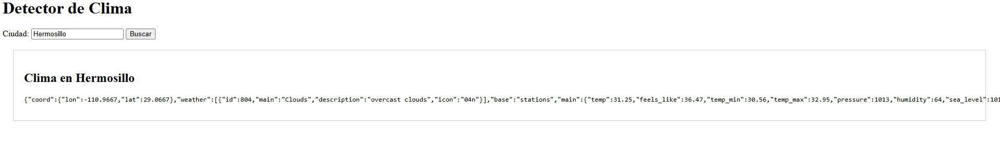
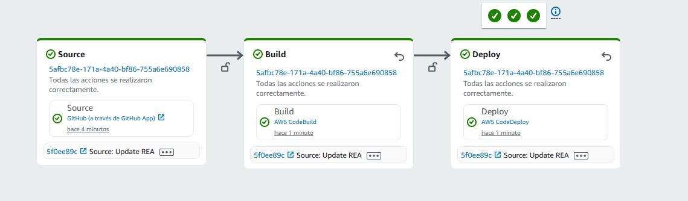
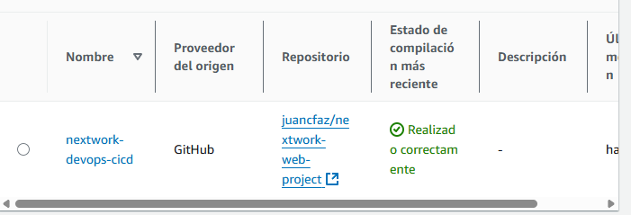
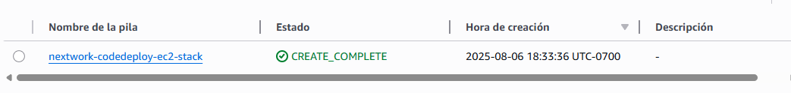
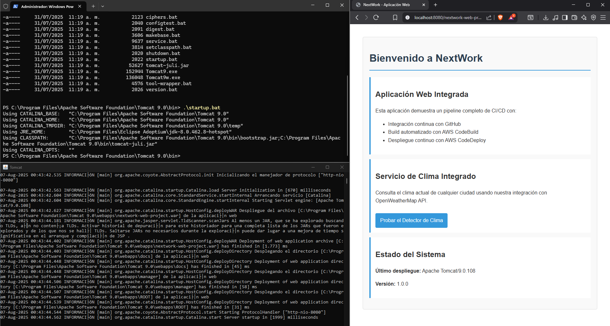
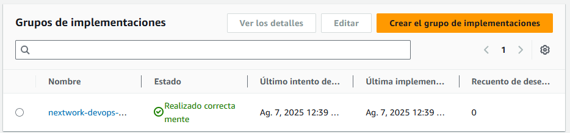

# NextWork - Aplicación Web con Pipeline CI/CD en AWS

[](https://opensource.org/licenses/Apache-2.0)

Aplicación web Java con servicio de clima integrado, implementando un pipeline completo de CI/CD en AWS usando:
- **EC2, S3, IAM**
- **CodePipeline, CodeBuild, CodeDeploy**
- **CodeArtifact, CloudFormation**

## Características Principales

✅ Servicio de clima usando OpenWeatherMap API  
✅ Pipeline automatizado de CI/CD en AWS  
✅ Despliegue en instancias EC2 con Tomcat  
✅ Gestión de dependencias con CodeArtifact  
✅ Infraestructura como código con CloudFormation  

## Configuración del Proyecto

1. Clonar repositorio:
```bash
  git clone https://github.com/tu-usuario/nextwork-web-project.git
  cd nextwork-web-project
```

2. Configurar variables de entorno:
```bash
  export OWM_API_KEY=""
```

3. Construir proyecto:
```bash
  mvn clean package
```

## Despliegue Manual

1. Copiar WAR a Tomcat:
```bash
  sudo cp target/nextwork-web-project.war /usr/share/tomcat/webapps/
```

2. Iniciar servicios:
```bash
  sudo systemctl start tomcat
  sudo systemctl start httpd
```

3. Entras al navegador:
```text
  http://localhost:8080/nextwork-web-project/
```

## Pipeline CI/CD Automatizado

El pipeline se compone de las siguientes etapas:

1. Source: Conexión con GitHub via CodeConnection

2. Build: Compilación con Maven usando CodeBuild. Gestión de dependencias con CodeArtifact

3. Deploy: Despliegue en EC2 usando CodeDeploy. Configuración con appspec.yml


## Variables de Entorno Requeridas

OWM_API_KEY	API Key para OpenWeatherMap

CODEARTIFACT_AUTH_TOKEN	Token para CodeArtifact (generado automáticamente)

## 📸 Demo Visual

### 1. Interfaz de la aplicación
  
*Página principal*

  
*Resultado del clima*

### 2. Pipeline CI/CD en AWS
  
*Pantalla completa de CodePipeline (con las etapas Source, Build, Deploy).*

  
*Detalle de CodeBuild (log de compilación exitosa).*

### 3. Infraestructura

  
*Pantalla completa de CodePipeline (con las etapas Source, Build, Deploy).*

  
*Consola de EC2 mostrando las instancias.*

### 4. Resultados de despliegue:

  
*Terminal con Tomcat iniciado (startup.bat en Windows).*

  
*Logs de CodeDeploy*
